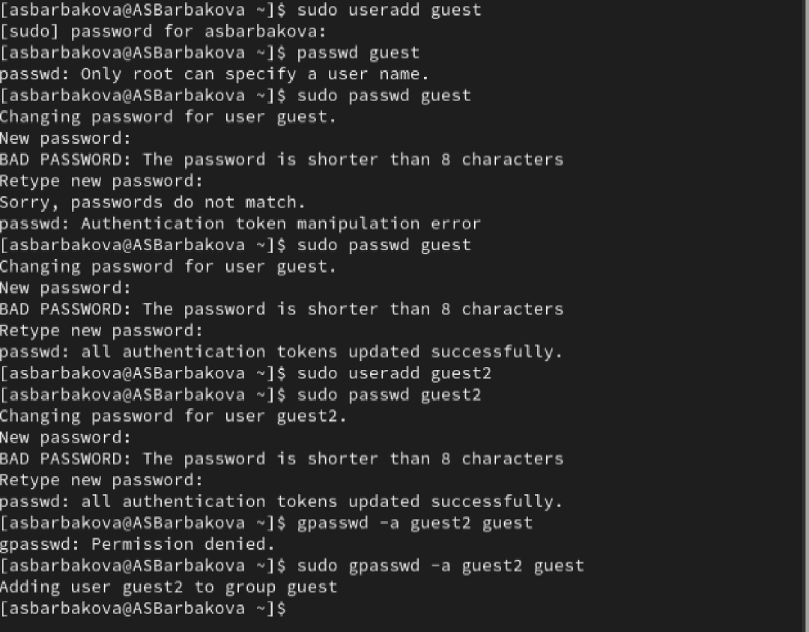
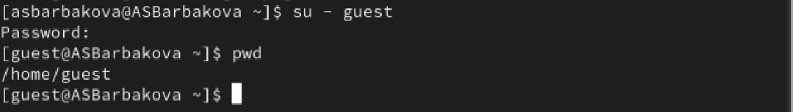
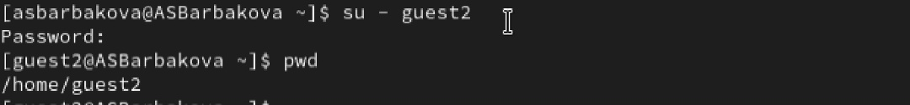
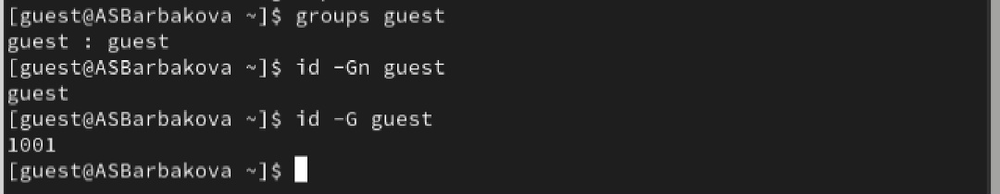
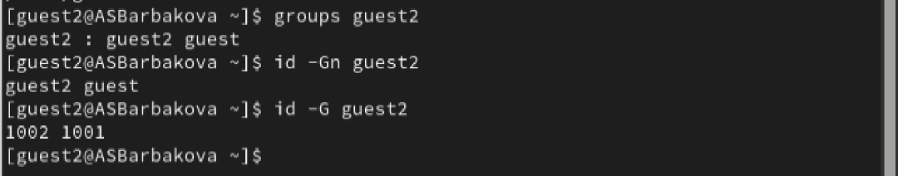
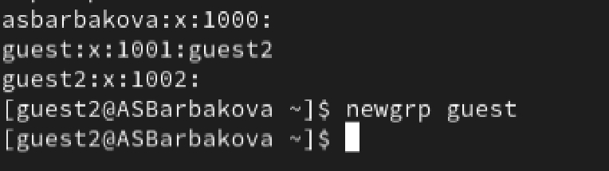
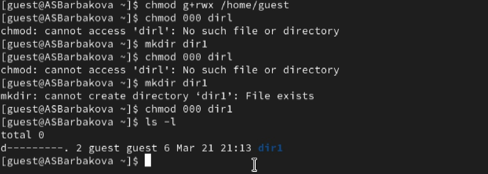

---
## Author
author:
  name: Барбакова Алиса Саяновна
  degrees: DSc
  orcid: 0000-0002-0877-7063
  email: 1132246727@rudn.ru
  affiliation:
    - name: Российский университет дружбы народов
      country: Российская Федерация
      postal-code: 117198
      city: Москва
      address: ул. Миклухо-Маклая

## Title
title: "Лабораторная работа №3"
subtitle: "Дискреционное разграничение прав в Linux. Два пользователя"
license: "CC BY"
---

# Цель работы

Получение практических навыков работы в консоли с атрибутами фай-
лов для групп пользователей.

# Задание

1. В установленной операционной системе создайте учётную запись поль-
зователя guest  
2. Задайте пароль для пользователя guest  
3. Аналогично создайте второго пользователя guest2.  
4. Добавьте пользователя guest2 в группу guest.  
5. Осуществите вход в систему от двух пользователей на двух разных консолях: guest на первой консоли и guest2 на второй консоли.  
6. Для обоих пользователей командой pwd определите директорию, в кото-
рой вы находитесь. Сравните её с приглашениями командной строки.  
7. Уточните имя вашего пользователя, его группу, кто входит в неё и к каким группам принадлежит он сам.  
8. Сравните полученную информацию с содержимым файла /etc/group.  
9. От имени пользователя guest2 выполните регистрацию пользователя
guest2 в группе guest.  
10. От имени пользователя guest измените права директории /home/guest,
разрешив все действия для пользователей группы.  
11. От имени пользователя guest снимите с директории /home/guest/dir1
все атрибуты и проверьте правильность снятия атрибутов. Меняя атрибуты у директории dir1 и файла file1 от имени пользователя guest и делая проверку от пользователя guest2, заполните табл. 3.1, определив опытным путём, какие операции разрешены, а какие нет. Если операция разрешена, занесите в таблицу знак «+», если не разрешена, знак «-». Сравните табл. 2.1 (из лабораторной работы № 2) и табл. 3.1. На основании заполненной таблицы определите те или иные минимально необходимые права для выполнения пользователем guest2 операций внутри директории dir1 и заполните табл. 3.2

# Теоретическое введение

**Права доступа** определяют, какие действия конкретный пользователь может или не может совершать с определенным файлами и каталогами. С помощью разрешений можно создать надежную среду — такую, в которой никто не может поменять содержимое ваших документов или повредить системные файлы.

**Группы пользователей Linux** кроме стандартных root и users, здесь есть еще пару десятков групп. Это группы, созданные программами, для управления доступом этих программ к общим ресурсам. Каждая группа разрешает чтение или запись определенного файла или каталога системы, тем самым регулируя полномочия пользователя, а следовательно, и процесса, запущенного от этого пользователя. Здесь можно считать, что пользователь - это одно и то же что процесс, потому что у процесса все полномочия пользователя, от которого он запущен.

- daemon - от имени этой группы и пользователя daemon запускаютcя сервисы, которым необходима возможность записи файлов на диск.
- sys - группа открывает доступ к исходникам ядра и файлам - include сохраненным в системе
- sync - позволяет выполнять команду /bin/sync
- games - разрешает играм записывать свои файлы настроек и историю в определенную папку
- man - позволяет добавлять страницы в директорию /var/cache/man
- lp - позволяет использовать устройства параллельных портов
- mail - позволяет записывать данные в почтовые ящики /var/mail/
- proxy - используется прокси серверами, нет доступа записи файлов на диск
- www-data - с этой группой запускается веб-сервер, она дает доступ на запись /var/www, где находятся файлы веб-документов
- list - позволяет просматривать сообщения в /var/mail
- nogroup - используется для процессов, которые не могут создавать файлов на жестком диске, а только читать, обычно применяется вместе с пользователем nobody.
- adm - позволяет читать логи из директории /var/log
- tty - все устройства /dev/vca разрешают доступ на чтение и запись пользователям из этой группы
- disk - открывает доступ к жестким дискам /dev/sd* /dev/hd*, можно сказать, что это аналог рут доступа.
- dialout - полный доступ к серийному порту
- cdrom - доступ к CD-ROM
- wheel - позволяет запускать утилиту sudo для повышения привилегий
- audio - управление аудиодрайвером
- src - полный доступ к исходникам в каталоге /usr/src/
- shadow - разрешает чтение файла /etc/shadow
- utmp - разрешает запись в файлы /var/log/utmp /var/log/wtmp
- video - позволяет работать с видеодрайвером
- plugdev - позволяет монтировать внешние устройства USB, CD и т д
- staff - разрешает запись в папку /usr/local

# Выполнение лабораторной работы
1. В системе создаю учетную запись guest(useradd guest), задаю пароль(passwd guest). Аналогично для guest2 ([рис. @fig-001]).  

{#fig-001 width=70%}

2. Осуществляю вход в систему от двух пользователей на двух разных консолях: guest на первой консоли и guest2 на второй консоли. Для обоих пользователей командой pwd определяю директорию, в которой я нахожусь ([рис. @fig-002]), ([рис. @fig-003]).

{#fig-002 width=70%}  

{#fig-003 width=70%}  

3. Уточняю имя пользователя, его группу, кто входит в неё и к каким группам принадлежит он сам. Определяю командами groups guest и groups guest2, в какие группы входят пользователи guest и guest2. Сравниваю вывод команды groups с выводом команд id -Gn и id -G  ([рис. @fig-004]), ([рис. @fig-005]).  

{#fig-004 width=70%}  

{#fig-005 width=70%} 

4. Сравниваю полученную информацию с содержимым файла /etc/group. Просматриваю файл командой cat /etc/group. От имени пользователя guest2 выполняю регистрацию пользователя guest2 в группе guest командой newgrp guest ([рис. @fig-008]).  

{#fig-008 width=70%}  

5. От имени пользователя guest изменяю права директории /home/guest, разрешив все действия для пользователей группы: chmod g+rwx /home/guest. От имени пользователя guest снимаю с директории /home/guest/dir1 все атрибуты командой chmod 000 dir1 и проверяю правильность снятия атрибутов ([рис. @fig-009]).  

{#fig-009 width=70%} 

# Выводы

Были получены практические навыки работы в консоли с атрибутами файлов для групп пользователей.

# Список литературы{.unnumbered}

[0] Методические материалы курса

[1] Права доступа: https://codechick.io/tutorials/unix-linux/unix-linux-permissions
::: {#refs}
:::
