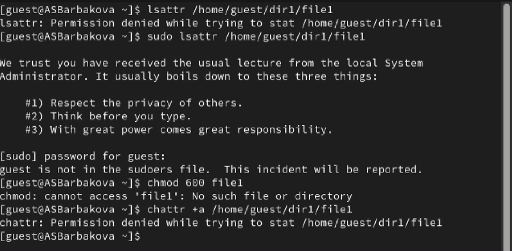
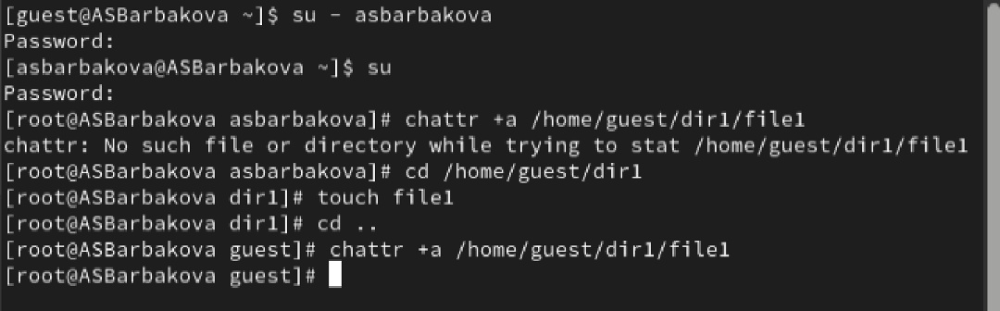
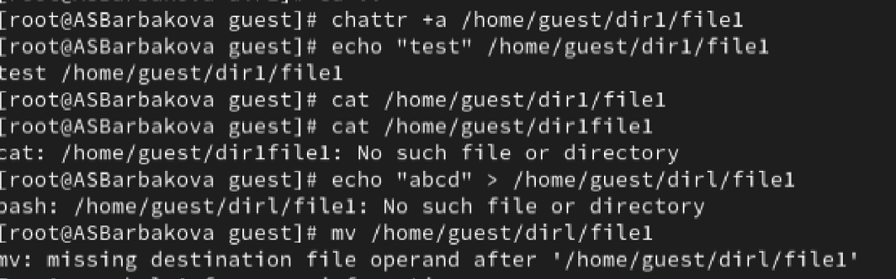
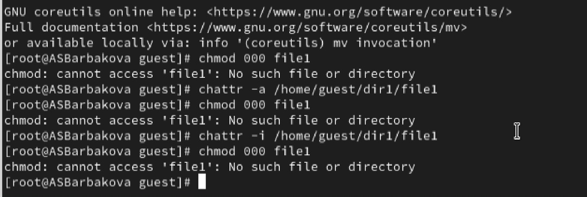

---
## Author
author:
  name: Барбакова Алиса Саяновна
  orcid: 0000-0002-0877-7063
  email: 1132246727@rudn.ru
  affiliation:
    - name: Российский университет дружбы народов
      country: Российская Федерация
      postal-code: 117198
      city: Москва
      address: ул. Миклухо-Маклая
## Title
title: "Лабораторная работа №4"
subtitle: "Дискреционное разграничение прав в Linux. Расширенные атрибуты"
license: CC BY
date: today
date-format: "YYYY-MM-DD" # Example: 2025-09-06
---

# Информация

## Докладчик

:::::::::::::: {.columns align=center}
::: {.column width="70%"}

  * Барбакова Алиса Саяновна
  * НКАбд-01-24
  * Российский университет дружбы народов им. П. Лумумбы
  * [1132246727@rudn.ru]

:::
::: {.column width="30%"}

:::
::::::::::::::

# Вводная часть

## Цель работы

Получение практических навыков работы в консоли с расширенными атрибутами файлов.

## Задание

1. От имени пользователя guest определите расширенные атрибуты файла /home/guest/dir1/file1  
2. Установите командой на файл file1 права, разрешающие чтение и запись для владельца файла.  
3. Попробуйте установить на файл /home/guest/dir1/file1 расширенный атрибут a от имени пользователя guest.  
4. Зайдите на третью консоль с правами администратора, попробуйте установить расширенный атрибут a на файл /home/guest/dir1/file1 от имени суперпользователя  
5. От пользователя guest проверьте правильность установления атрибута    

## Задание

6. Выполните дозапись в файл file1 слова «test» командой. После этого выполните чтение файла file1 командой cat. Убедитесь, что слово test было успешно записано в file1.  
7. Попробуйте удалить файл file1 либо стереть имеющуюся в нём информацию командой. Попробуйте переименовать файл.  
8. Попробуйте с помощью команды установить на файл file1 права, например, запрещающие чтение и запись для владельца файла.  
9. Снимите расширенный атрибут a с файла /home/guest/dirl/file1 от имени суперпользователя командой.  
10. Повторите ваши действия по шагам, заменив атрибут «a» атрибутом «i».  

## Теоретическое введение

Дискреционное управление доступом (DAC) в Linux — это классическая модель защиты, при которой владелец объекта (файла или каталога) сам определяет права доступа к нему для других пользователей.  
Стандартная система прав в Linux базируется на трех категориях субъектов и трех типах действий:  

1. Категории пользователей:  
        * u (user) — владелец файла.  
        * g (group) — группа, владеющая файлом.  
        * o (others) — все остальные пользователи системы.  
2. Типы прав:  
        * r (read) — чтение содержимого.  
        * w (write) — изменение содержимого или удаление (для каталогов).  
        * x (execute) — запуск файла или вход в каталог.  

## Теоретическое введение

Для управления этими правами используются команды chmod (изменение прав) и chown (смена владельца).  

*Расширенные атрибуты (xattr)*  
Помимо стандартных прав, файловые системы Linux (ext4, XFS, Btrfs) поддерживают расширенные атрибуты — дополнительные пары «ключ-значение», которые расширяют возможности метаданных.  
Они делятся на четыре пространства имен:  
* user: Доступны обычным пользователям (например, для хранения меток файлов или иконок).  
* system: Используются ядром системы (например, для хранения списков контроля доступа — ACL).  
* security: Используются модулями безопасности, такими как SELinux или AppArmor, для хранения меток безопасности.  
* trusted: Доступны только процессам с привилегиями CAP_SYS_ADMIN (обычно root), используются для хранения данных вне видимости обычных пользователей.  

## Выполнение лабораторной работы

1. От имени пользователя guest определяю расширенные атрибуты файла /home/guest/dir1/file1 командой lsattr /home/guest/dir1/file1  
2. Установливаю командой chmod 600 file1 на файл file1 права, разрешающие чтение и запись для владельца файла.  
3. Пробую установить на файл /home/guest/dir1/file1 расширенный атрибут a от имени пользователя guest:  
chattr +a /home/guest/dir1/file1  

##

В ответ получаю отказы от выполнения операции ([рис. @fig-001]).  

{#fig-001 width=70%}

## Выполнение лабораторной работы

4. Захожу на третью консоль с правами администратора. Попробую установить расширенный атрибут a на файл /home/guest/dir1/file1 от имени суперпользователя ([рис. @fig-002]) :  
chattr +a /home/guest/dir1/file1  

{#fig-002 width=70%}

## Выполнение лабораторной работы

5. От пользователя guest проверьте правильность установления атрибута ([рис. @fig-003]) :  
lsattr /home/guest/dir1/file1  

{#fig-003 width=70%}  

Полагаю, что всё правильно.  

## Выполнение лабораторной работы

6. Выполняю дозапись в файл file1 слова «test» командой echo "test" /home/guest/dir1/file1. После этого выполняю чтение файла file1 командой cat /home/guest/dir1/file1.  
7. Пробую удалить файл file1 либо стереть имеющуюся в нём информацию командой echo "abcd" > /home/guest/dirl/file1 ([рис. @fig-004])  

{#fig-004 width=70%}  

## Выполнение лабораторной работы

8. Пробую с помощью команды chmod 000 file1 установить на файл file1 права, например, запрещающие чтение и запись для владельца файла.  
9. Снимаю расширенный атрибут a с файла /home/guest/dirl/file1 от имени суперпользователя командой chattr -a /home/guest/dir1/file1. Повторяю операции, которые ранее не удавалось выполнить.  

##

10. Повторите ваши действия по шагам, заменив атрибут «a» атрибутом «i». Удалось ли вам дозаписать информацию в файл? Не совсем. ([рис. @fig-005]).  

{#fig-005 width=70%}  

## Выводы

В результате выполнения работы я повысила свои навыки использования интерфейса командой строки (CLI), познакомилась на примерах с тем, как используются основные и расширенные атрибуты при разграничении доступа. Имела возможность связать теорию дискреционного разделения доступа (дискреционная политика безопасности) с её реализацией на практике в ОС Linux. Опробовала действие на практике расширенных атрибутов «а» и «i».
