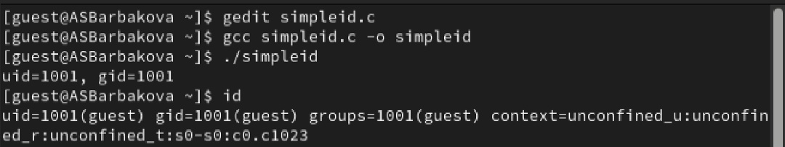
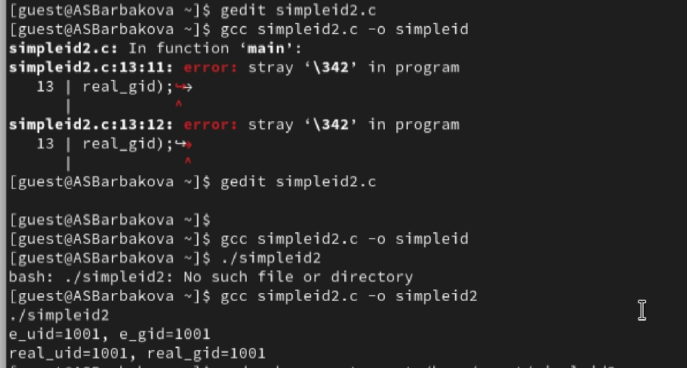
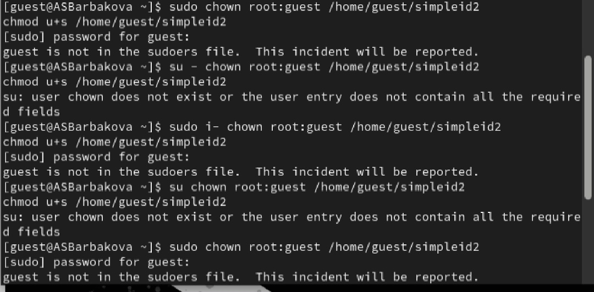
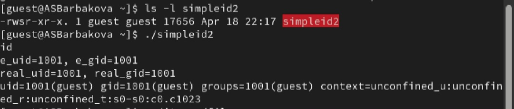
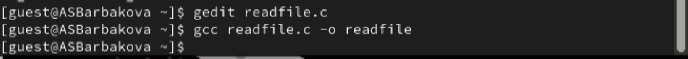
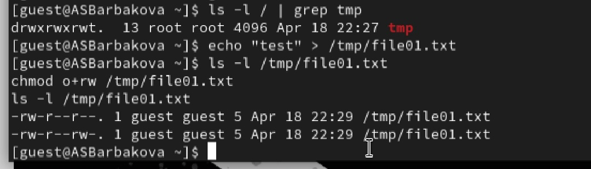
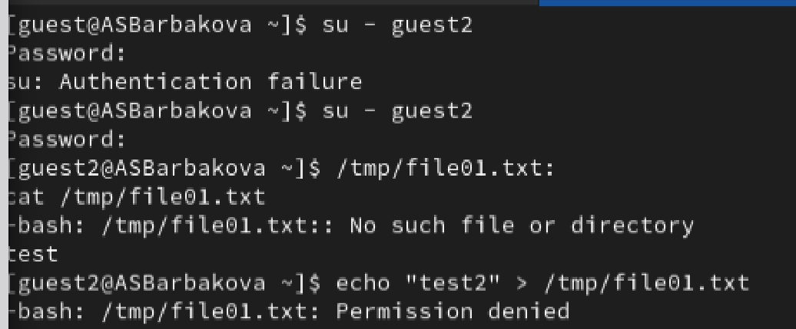
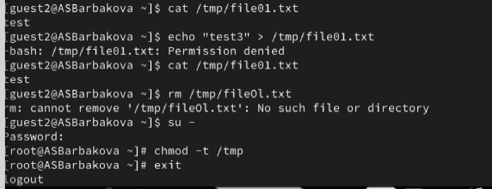
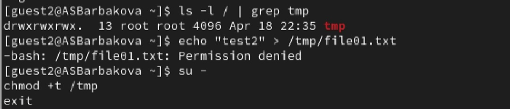
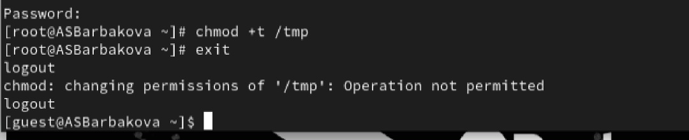

---
## Author
author:
  name: Барбакова Алиса Саяновна
  degrees: DSc
  orcid: 0000-0002-0877-7063
  email: 1132246727@rudn.ru
  affiliation:
    - name: Российский университет дружбы народов
      country: Российская Федерация
      postal-code: 117198
      city: Москва
      address: ул. Миклухо-Маклая

## Title
title: "Лабораторная работа №5"
subtitle: "Дискреционное разграничение прав в Linux. Исследование влияния дополнительных атрибутов"
license: "CC BY"
---
# Цель работы

Изучение механизмов изменения идентификаторов, применения SetUID- и Sticky-битов. Получение практических навыков работы в консоли с дополнительными атрибутами. Рассмотрение работы механизма смены идентификатора процессов пользователей, а также влияние бита Sticky на запись и удаление файлов.

# Теоретическое введение

1. Дополнительные атрибуты файлов Linux

В Linux существует три основных вида прав — право на чтение (read), запись (write) и выполнение (execute), а также три категории пользователей, к которым они могут применяться — владелец файла (user), группа владельца (group) и все остальные (others). Но, кроме прав чтения, выполнения и записи, есть еще три дополнительных атрибута. 

**Sticky bit**

Используется в основном для каталогов, чтобы защитить в них файлы. В такой каталог может писать любой пользователь. Но, из такой директории пользователь может удалить только те файлы, владельцем которых он является. Примером может служить директория /tmp, в которой запись открыта для всех пользователей, но нежелательно удаление чужих файлов.

**SUID (Set User ID)**

Атрибут исполняемого файла, позволяющий запустить его с правами владельца. В Linux приложение запускается с правами пользователя, запустившего указанное приложение. Это обеспечивает дополнительную безопасность т.к. процесс с правами пользователя не сможет получить доступ к важным системным файлам, которые принадлежат пользователю root.

**SGID (Set Group ID)**

Аналогичен suid, но относиться к группе. Если установить sgid для каталога, то все файлы созданные в нем, при запуске будут принимать идентификатор группы каталога, а не группы владельца, который создал файл в этом каталоге.

**Обозначение атрибутов sticky, suid, sgid**

Специальные права используются довольно редко, поэтому при выводе программы ls -l символ, обозначающий указанные атрибуты, закрывает символ стандартных прав доступа.

Пример:
`rwsrwsrwt`

где первая s — это suid, вторая s — это sgid, а последняя t — это sticky bit

В приведенном примере не понятно, rwt — это rw- или rwx? Определить это просто. Если t маленькое, значит x установлен. Если T большое, значит x не установлен. То же самое правило распространяется и на s.

В числовом эквиваленте данные атрибуты определяются первым символом при четырехзначном обозначении (который часто опускается при назначении прав), например в правах 1777 — символ 1 обозначает sticky bit. 

2. Компилятор GCC

GСС - это свободно доступный оптимизирующий компилятор для языков C, C++. Собственно программа gcc это некоторая надстройка над группой компиляторов, которая способна анализировать имена файлов, передаваемые ей в качестве аргументов, и определять, какие действия необходимо выполнить. Файлы с расширением .cc или .C рассматриваются, как файлы на языке C++, файлы с расширением .c как программы на языке C, а файлы c расширением .o считаются объектными [@gcc].

# Выполнение лабораторной работы

Осуществляется вход от имени пользователя guest. Создание файла simpleid.c и запись в файл кода.  
Содержимое файла:  

```
#include <sys/types.h>  
#include <unistd.h>  
#include <stdio.h>  
int  
main ()  
{  
uid_t uid = geteuid ();  
gid_t gid = getegid ();  
printf ("uid=%d, gid=%d\n", uid, gid);  
return 0;  
}  
```

Компилирую файл, проверяю, что он скомпилировался. Запускаю исполняемый файл. В выводе файла выписаны номера пользоватея и групп, от вывода при вводе id, они отличаются только тем, что информации меньше ([рис. @fig-001]).

{#fig-001 width=70%}

Создание, запись в файл и компиляция файла simpleid2.c. Запуск программы ([рис. @fig-002]).

{#fig-002 width=70%}

С помощью chown изменяю владельца файла на суперпользователя, с помощью chmod изменяю права доступа ([рис. @fig-003]).

{#fig-003 width=70%}

Сравнение вывода программы и команды id, наша команда снова вывела только ограниченное количество информации ([рис. @fig-004]).

{#fig-004 width=70%}

Создание и компиляция файла readfile.c ([рис. @fig-005]).

{#fig-005 width=70%}

Проверяем папку tmp на наличие атрибута Sticky, т.к. в выводе есть буква t, то атрибут установлен. От имени пользователя guest создаю файл с текстом, добавляю права на чтение и запись для других пользователей ([рис. @fig-006]).

{#fig-006 width=70%}

Вхожу в систему от имени пользователя guest2, от его имени могу прочитать файл file01.txt, но перезаписать информацию в нем не могу. Также невозможно добавить в файл file01.txt новую информацию от имени пользователя guest2.  ([рис. @fig-007]).

{#fig-007 width=70%}

От имени суперпользователя снимаем с директории атрибут Sticky ([рис. @fig-008]).

{#fig-008 width=70%}

Возвращение директории tmp атрибута t от имени суперпользователя ([рис. @fig-009]).

{#fig-009 width=70%}

Повышаю свои права до суперпользователя и возвращаю атрибут t на директорию /tmp ([рис. @fig-010]).

{#fig-010 width=70%}

# Выводы

Изучила механизм изменения идентификаторов, применила SetUID- и Sticky-биты. Получила практические навыки работы в консоли с дополнительными атрибутами. Рассмотрела работы механизма смены идентификатора процессов пользователей, а также влияние бита Sticky на запись и удаление файлов.

# Список литературы

[0] Методические материалы курса

[1] Права доступа: https://codechick.io/tutorials/unix-linux/unix-linux-permissions
