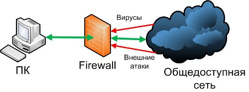
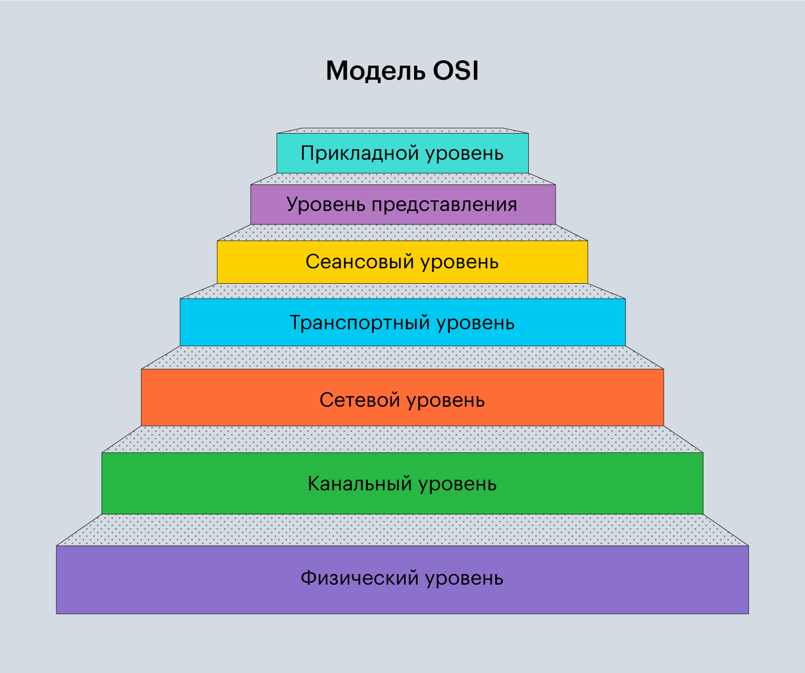
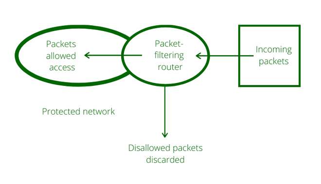

---
## Author
author:
  name: Барбакова Алиса Саяновна
  orcid: 0000-0002-0877-7063
  email: 1132246727@rudn.ru
  affiliation:
    - name: Российский университет дружбы народов
      country: Российская Федерация
      postal-code: 117198
      city: Москва
      address: ул. Миклухо-Маклая
## Title
title: "Фильтрация пакетов: параметры и правила фильтрации."
subtitle: "Лекция №4"
license: CC BY
date: today
date-format: "YYYY-MM-DD" # Example: 2025-09-06
---

# Информация

## Докладчик

:::::::::::::: {.columns align=center}
::: {.column width="70%"}

  * Барбакова Алиса Саяновна
  * НКАбд-01-24
  * Российский университет дружбы народов им. П. Лумумбы
  * [1132246727@rudn.ru]

:::
::: {.column width="30%"}

:::
::::::::::::::

# Вводная часть

## Актуальность

- Фильтрация пакетов является первой линией защиты для обеспечения сети.  
- С ростом числа сетевых атак и усложнением инфраструктур корректная настройка правил фильтрации становится обязательным условием безопасной работы организаций.

##
{#fig-1 width=70%} 

## Объект и предмет исследования

- Объект исследования - фильтрация сетевых пакетов как механизм обеспечения информационной безопасности.  
- Предмет исследования - параметры и правила фильтрации, используемые в межсетевых экранах (firewall) и системах предотвращения вторжений(IPS).  

## Цели и задачи

1. Изучить основные параметры, по которым выполняется фильтрация пакетов  
2. Рассмотреть типы правил фильтрации  
3. Проинформировать студентов о механизме фильтрации сетевых пакетов  

## Материалы и методы

Исследование проводится методом анализа технической документации и научных статей по сетевой безопасности на тему доклада.

# Содержание исследования

## Основные параметры фильтрации
{#fig-3 width=70%}  
Основные параметры:  
- IP-адрес источника и IP-адреса назначения  
- Номер порта TCP/UDP  
- Тип протокола (TCP, UDP, ICMP и т. д.)  

## Правила фильтрации и их применение  

В МЭ имеются следующие группы правил:  
- MAC-правила – правила фильтрации на уровне кадров Ethernet.  
- ARP-правила – правила фильтрации пакетов ARP и RARP.  
- IP-правила – правила фильтрации пакетов протокола IPv4.   
- IPv6 — правила фильтрации пакетов протокола нового поколения.  
- AP-правила – правила фильтрации прикладного уровня.  

## Правила фильтрации и их применение 
{#fig-2 width=70%} 

## Правила фильтрации и их применение 
*If (параметры правила) – then (действие правила)*   
{#fig-4 width=70%}  

## Правила фильтрации и их применение 
Допускаются следующие возможные действия над пакетом:  
 - match. Если пакет удовлетворяет условиям правила, то указания из данного правила выполняются сразу.  
 - block. Если пакет не удовлетворяет условиям правила, то он помечается как подлежащий блокировке.  
 - pass. Если пакет удовлетворяет условиям правила, то он помечается как подлежащий пропуску далее.  

## Результаты

- Изучен механизм используемый МЭ для фильтрации пакетов
- Проанализирована иерархия правил фильтрации от канального до прикладного уровней 
- Проинформированность о ключевых отличиях в действиях над пакетами (пропуск, сброс, модификация)

## Итог

Фильтрация пакетов является ключевым механизмом обеспечения сетевой безопасности. Корректная настройка правил фильтрации позволяет предотвращать несанкционированный доступ и снижать риски сетевых атак.  
Таким образом, эффективность защиты сети во многом зависит от того, насколько грамотно настроены параметры и правила фильтрации.

