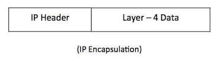
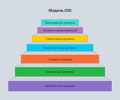

---
## Author
author:
  name: Барбакова Алиса Саяновна
  degrees: Студентка 2 курса бакалавриата ФФМиЕН, НКАбд-01-24
  email: 1132246727@rudn.ru
  affiliation:
    - name: Российский университет дружбы народов
      country: Российская Федерация
      city: Москва
      address: ул. Миклухо-Маклая

## Title
title: 'Доклад на тему "Фильтрация пакетов: параметры и правила фильтрации."'
subtitle: "Преподаватель - Кулябов Дмитрий Сергеевич, д.ф.-м.н, профессор кафедры теории вероятностей и кибербезопасности"
license: CC BY
date: today
date-format: "YYYY-MM-DD"
incremental: false
---

# Объект и предмет исследования
Объект исследования - фильтрация сетевых пакетов как механизм обеспечения информационной безопасности.  
Предмет исследования - параметры и правила фильтрации, используемые в межсетевых экранах (firewall) и системах предотвращения вторжений(IPS).

# Актуальность
Фильтрация пакетов - это фундаментальная техника сетевой безопасности, которая проверяет пакеты данных по мере их перемещения через устройства безопасности, такие как маршрутизаторы или межсетевые экраны (рис. @fig-1).  
С ростом числа сетевых атак и усложнением инфраструктур корректная настройка правил фильтрации становится обязательным условием безопасной работы организаций. Фильтрация пакетов является первой линией защиты для обеспечения сети. Этот механизм позволяет администраторам контролировать поток трафика и обеспечить соблюдение политик безопасности.  
{#fig-1 width=70%}  

# Цели и задачи
1. Изучить основные параметры, по которым выполняется фильтрация пакетов
2. Рассмотреть типы правил фильтрации
3. Проинформировать студентов о механизме фильтрации сетевых пакетов

# Материалы и методы
Исследование проводится методом анализа технической документации и научных статей по сетевой безопасности на тему доклада.

# Содержание исследования
## Основные параметры фильтрации
{#fig-3 width=70%} 
В своей сути фильтрация пакетов - это тип технологии межсетевых экранов, который фильтрует входящие и исходящие пакеты данных на основе набора правил. Эти правила определяют, следует ли пропускать или блокировать пакеты данных, исходя из их параметров, таких как(см. рис. @fig-3):  
- IP-адрес источника и IP-адреса назначения: информация «от кого» и «кому» передаются данные пакета. Проверяя IP-адрес, межсетевой экран может быть настроен на пропуск или блокировку данных из определенных источников или в определенные места назначения.
- Номер порта TCP/UDP: TCP и UDP являются основными протоколами в сфере IP-связи. Анализируя номер порта в заголовке пакета, фильтр может принимать решения о типе прикладных протоколов, таких как FTP или Telnet, с которыми связан пакет.
- Тип протокола (TCP, UDP, ICMP и т. д.): протокол определяет, как данные отправляются и принимаются по сети.  
 
## Правила фильтрации и их применение  
Фильтрация сетевого трафика может осуществляться на различных уровнях сетевого взаимодействия(рис. @fig-2). Каждому из уровней соответствует определенная группа правил фильтрации. Правила фильтрации каждой группы задают параметры заголовков пакетов, соответствующих протоколу данного уровня взаимодействия.  
В МЭ имеются следующие группы правил:  
- MAC-правила – правила фильтрации на уровне кадров Ethernet.
- ARP-правила – правила фильтрации пакетов ARP и RARP.
- IP-правила – правила фильтрации пакетов протокола IPv4.  
- IPv6 — правила фильтрации пакетов протокола нового поколения.
- AP-правила – правила фильтрации прикладного уровня.  
{#fig-2 width=70%}  
В обобщенном виде любое правило фильтрации представляет собой логическую конструкцию  
*If (параметры правила) – then (действие правила)*   
(рис. @fig-4).  
{#fig-4 width=70%}  
Это значит, что если заголовок поступившего пакета соответствует параметрам правила, то к пакету следует применить действие, указанное в правиле. При этом допускаются следующие возможные действия над пакетом:  
 - match. Если пакет удовлетворяет условиям правила, то указания из данного правила выполняются сразу. match-правила обычно используются для NAT, журналирования трафика, QoS и так далее.  
 - block. Если пакет не удовлетворяет условиям правила, то он помечается как подлежащий блокировке. Позволяет как просто отбросить пакет, так и сгенерировать ICMP-сообщение об ошибке.  
 - pass. Если пакет удовлетворяет условиям правила, то он помечается как подлежащий пропуску далее.  
В режиме пакетной фильтрации обработка пакетов в МЭ осуществляется в два этапа:  
1. Фильтрация по МАС-правилам(чаще в прозрачных мостах "Bridge Mode").  
2. Фильтрация по правилам следующего уровня (ARP-, IP- или IPv6-правила).  
Сначала каждый пакет, принятый фильтрующими интерфейсами МЭ, обрабатывается на уровне кадров Ethernet в соответствии с MAC-правилами фильтрации. Если к пакету применяется правило, предписывающее удаление пакета, то пакет никуда не передается и его обработка заканчивается. Иначе данный пакет передается на следующий уровень фильтрации, где и принимается окончательное решение о его пропуске или удалении. Если к пакету применяется правило, предписывающее передачу пакета, то процедура фильтрации данного пакета завершается и пакет передается на выходные интерфейсы.

# Результаты
В результате исследования я:
- Изучила механизм используемый МЭ для фильтрации пакетов
- Проанализировала иерархию правил фильтрации от канального до прикладного уровней 
- Проинформировала о ключевых отличиях в действиях над пакетами (пропуск, сброс, модификация)

# Список литературы{.unnumbered}
studfile.net - ["Правила фильтрации"](https://studfile.net/preview/12963888/page:5/#11)  

tufin - ["Packet Filtering"](https://www.tufin.com/blog/packet-filtering-firewall-basics-benefits)

ru.wikipedia.org - ["Packet Filter"](https://ru.wikipedia.org/wiki/Packet_Filter#cite_ref-7)  

